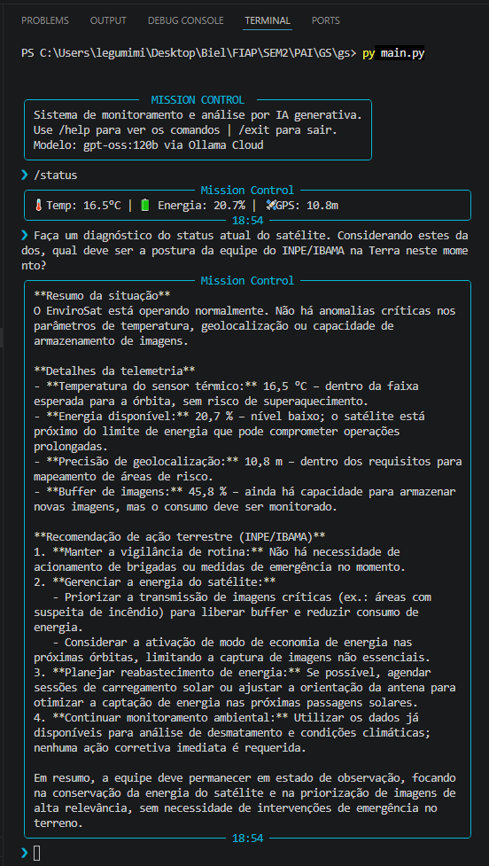
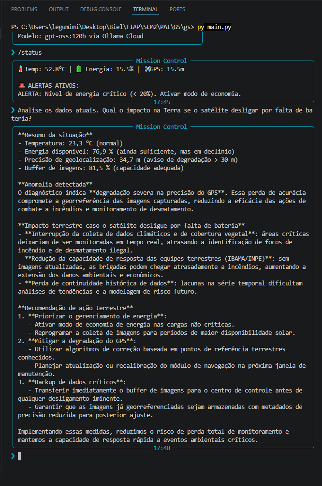

# Mission Control AI - EnviroSat

## Integrantes
- André Henrique Camponucci - RM: 568048 - Turma: 1CCPR25
- Dante Daher Garçon - RM: 567727 - Turma: 1CCPR25
- Gabriel Kenishi Furuzawa - RM: 568245 - Turma: 1CCPR25

Modalidade: Trio

## Sobre o Projeto
O Mission Control AI é um sistema de monitoramento operacional para o satélite EnviroSat. Ele simula a recepção de dados orbitais de telemetria (temperatura, níveis de bateria, margem de GPS), detecta anomalias usando lógica em Python e utiliza IA Generativa via Ollama Cloud para interpretar essas anomalias e gerar relatórios táticos em linguagem natural.

## Persona Atendida
**Operador de Centro de Controle Ambiental (INPE / IBAMA)**. A solução traduz falhas de hardware em órbita ou dados captados em anomalias ambientais, permitindo que a equipe terrestre dimensione sua resposta tática a incêndios florestais ou desmatamento sem precisar ser especialista em engenharia aeroespacial.

## Tecnologias Utilizadas
- **Linguagem:** Python 3.10+
- **IA Generativa:** Ollama Cloud API (modelo `gpt-oss:120b`)
- **Bibliotecas Principais:** `ollama`, `python-dotenv`, `rich`, `prompt-toolkit`, `pyfiglet`

## Como Executar
1. Clone este repositório.
2. Crie e ative um ambiente virtual: `python -m venv .venv`
3. Instale as dependências: `pip install -r requirements.txt`
4. Crie um arquivo `.env` na raiz do projeto contendo a sua chave da Ollama:
   `OLLAMA_API_KEY=sua_chave_aqui_sem_aspas`
5. Execute o sistema: `py main.py` (ou `python main.py`)

## Proposta de Valor e Modelo de Negócio

**1. Qual o problema real terrestre que esta missão resolve?**
O EnviroSat diminui drasticamente a latência na detecção de desastres ambientais, focando em duas frentes vitais: o combate ágil ao desmatamento ilegal e a resposta rápida a focos de incêndio em áreas de preservação ou rurais.

**2. Quem paga pela solução?**
Possui um modelo de financiamento público híbrido. O sistema é custeado pelo Governo Federal (através do Ministério do Meio Ambiente/INPE) e complementado por parcerias com fundos internacionais de proteção ambiental e agências estaduais.

**3. Métrica de impacto:**
Se o satélite operar 100% saudável durante 1 ano, projeta-se o monitoramento ininterrupto de mais de 5.000.000 de hectares de vegetação nativa sensível, reduzindo o tempo de resposta das brigadas terrestres a focos de calor em até 70%.

**4. Modelo de negócio:**
A arquitetura opera em modelo B2G (Business to Government) operando como *SaaS (Software as a Service)*. A empresa operadora licencia o acesso ao dashboard de inteligência, às análises de telemetria processadas pela IA e ao feed de alertas em tempo real.

## Cenários de Teste Demonstrados

1. **Operação Normal:** O sistema foi validado interpretando uma leitura com os três parâmetros principais (Temperatura, Bateria, Margem GPS) dentro das médias operacionais.
2. **Temperatura / Anomalia Crítica:** O sistema reage a valores altos de temperatura simulando a detecção de um potencial foco de incêndio, cruzando a falha de hardware/leitura com o protocolo emergencial do INPE.
3. **Bateria Crítica / Degradação de Sinal:** Cenários testados demonstram o LLM inferindo impacto direto na geolocalização de imagens satelitais em caso de queda de energia ou perda de eficiência do GPS.

## Limitações Conhecidas

* O sistema atual não possui um banco de dados persistente (SQL ou NoSQL) atrelado. Os logs e históricos de status são alocados durante a sessão ativa, não mantendo histórico de anomalias em longo prazo.
* As saídas da IA podem apresentar discretas variações de léxico de acordo com a predição da API em diferentes chamadas de teste.

## Demonstração Visual


*Cenário de operação padrão - Telemetria saudável.*


*Detecção de anomalia, acionamento do motor de decisão Python e relatório tático da IA.*

### Vídeo de Demonstração
[Assistir demonstração do projeto no YouTube]
(https://youtu.be/7JFbFWRvEII)
> O vídeo está configurado como "Não listado".

## System Prompt Utilizado
A Inteligência Artificial central foi guiada pela seguinte diretriz para contextualizar as decisões terrestres:

```text
Você é a Inteligência Artificial central do Mission Control do satélite EnviroSat.
Seu objetivo é analisar dados de telemetria simulados em tempo real e relatar o status da missão para os operadores do centro de controle ambiental na Terra.

DIRETRIZES OBRIGATÓRIAS:
1. CONTEXTO AMBIENTAL: O EnviroSat monitora o clima e a sustentabilidade, focando principalmente no combate ao desmatamento e na resposta rápida a incêndios florestais.
2. TRADUÇÃO DE IMPACTO TERRESTRE: Se houver um alerta crítico nos dados fornecidos (ex: temperatura acima de 60°C ou falha de GPS), você DEVE explicar o impacto disso na Terra. Exemplo: se a temperatura subir muito, indique que é um possível foco de incêndio florestal que exige o acionamento imediato das brigadas terrestres do IBAMA/INPE.
3. TOM DE VOZ: Profissional, técnico, de emergência quando necessário, mas sempre acessível para o operador terrestre.
4. ESTRUTURA: Responda de forma direta e concisa. Comece com um resumo da situação, detalhe a anomalia (se houver) e finalize com a recomendação de ação terrestre.